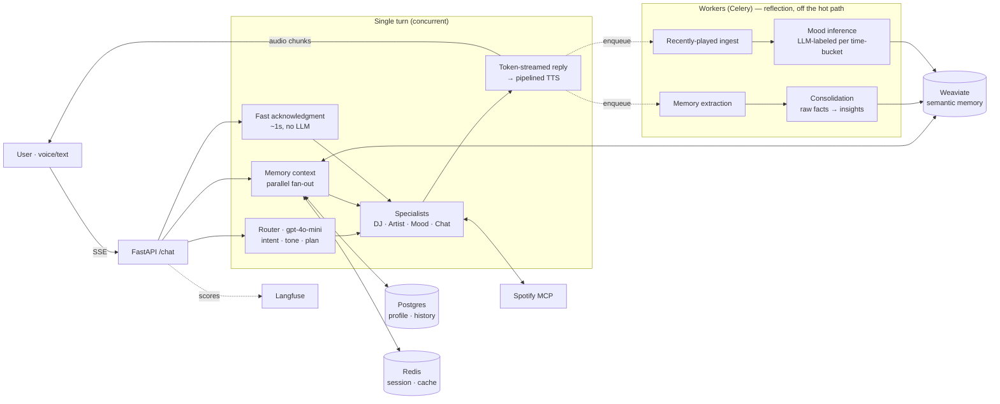

# Gia — a voice music companion

> A voice companion that knows your taste, sounds like a warm human, and notices your mood before you mention it — built to react in **under a second**, not to make you wait for a paragraph.

Gia isn't a "play me a song" bot. She's a stateful companion: she remembers what you've told her, synthesises it into a picture of *who you are*, picks one track with a reason instead of dumping ten, and gently notices when your listening drifts from your usual pattern.

> Demo video: _[link]_

---

## What it feels like

- You speak; she starts reacting in ~1s, then streams a warm, specific reply grounded in what she knows about you.
- *"his music is fire"* → she **reacts to you**, she doesn't silently queue something. *"play that"* → she plays it.
- She recalls earlier turns ("did you ever finish that script?"), and over time forms **insights** — not "likes Tems," but *"prefers emotionally expressive Afrobeats, leans to it when winding down."*

---

## Architecture



**Stack:** FastAPI (SSE streaming) · CrewAI-style agents · Weaviate (hybrid vector search) · Postgres (SQLAlchemy async) · Redis (session/cache/throttles) · Celery (reflection workers) · Langfuse (tracing + self-eval scores) · OpenAI / Anthropic / Ollama behind one provider abstraction · Kokoro (local TTS) / ElevenLabs (prod) · faster-whisper (STT) · Spotify via an MCP server.

---

## The thing I obsessed over: time-to-first-audio

A person tolerates two seconds of *thinking* if you start *reacting* in 300–500ms. So the metric isn't total response time — it's **TTFA**. Four design choices, compounding:

1. **Acknowledgment-first.** The two slowest pre-reply steps (building memory context, the router LLM) run **concurrently as background tasks**; a sub-millisecond keyword pass speaks a neutral filler ("One sec.") *while they're still in flight* — so the user hears Gia react before the router has even returned.
2. **Token-streamed replies.** Conversational turns stream the model's tokens, reassemble them into sentences, and fire TTS on sentence one while sentence two is still generating — instead of waiting for the whole reply.
3. **Pipelined TTS.** Synthesis for sentence *N+1* starts while sentence *N* is being delivered.
4. **Small router, big thinker.** `gpt-4o-mini` classifies intent/tone/plan in one structured call; the expensive persona model only runs when the turn actually needs it.

The neutral filler is deliberate: it's spoken *before* the real intent is known, so it claims nothing specific — it can front a recommendation, a clarifying question, or pure chat without ever contradicting the reply that follows.

---

## The memory system (why she feels like she knows you)

Memory is a real pipeline, not a chat-history window:

- **Extraction** — a background worker distils durable `preference` and `life_fact` memories from conversations (throttled, batched embeddings — one API call per pass).
- **Consolidation (the reflection loop)** — periodically, an LLM reads the *whole* set of raw facts and synthesises 2–4 higher-order **insights** ("uses music to focus; reaches for lyric-light tracks while working"). Insights are derived, so each run fully supersedes the last. They're injected *above* raw facts as the big-picture summary.
- **Retrieval** — hybrid search (BM25 for exact artist/track tokens + dense vectors for semantic intent), reranked, cached in Redis, assembled in parallel into one `UserContext`.
- **Mood, reflected from behavior** — recently-played tracks are ingested into history; a worker LLM-labels each `(weekday × time-of-day)` bucket into a closed mood vocabulary; when current listening drifts from the bucket's pattern, a proactive note is drafted for the next turn.

Everything degrades quietly — a flaky Weaviate or Spotify yields an empty slice, never a failed turn.

---

## Production posture

- **436 tests**, fully mocked external deps — runs offline, in CI, on a laptop.
- **Observability** — every turn is a Langfuse trace with nested agent spans and LLM generations, plus **self-evaluation scores** (`context_used`, `retrieval_used`, `router_confidence`, `turn_latency_ms`) so quality and cost are *measured*, not guessed.
- **Graceful degradation everywhere** — each external call has a fallback; a degraded service downgrades the turn, never breaks it.
- **Provider-agnostic** — OpenAI, Anthropic, and Ollama all work through one factory; no vendor lock-in.
- **Dependency-injected, typed** — Pydantic schemas at every boundary, protocol-based clients, externalised prompt templates.

---

## Design decisions & tradeoffs

**Spotify deprecated audio features mid-build — so I deleted them.** The DJ originally key-matched a crossfade queue using Camelot wheel + energy/valence. Spotify killed `/audio-features` for new apps, so those values became constants and the "harmonic sequencing" was a no-op. Rather than leave dead code computing on placeholders, I **removed the entire machinery** (crossfade module, audio-feature fetch, the feature fields on the track schema) and rebuilt queueing on signals that still exist: the user's stated track order, or search relevance. *Noticing the platform changed under me and re-architecting is the decision I'm most proud of here.*

**Mood, rebuilt the same way.** With audio features gone, mood couldn't be `(energy, valence)` quadrants. It's now an LLM labeling the *artists and track names* you actually play into a **closed vocabulary** — which keeps "current mood vs. your pattern" a clean string comparison instead of fuzzy numeric deviation.

**`played_at` is approximated.** Spotify's MCP recently-played carries no per-track timestamps, so ingestion stamps the poll time. With frequent use it's accurate to the time-bucket; I documented the approximation rather than pretend it's exact.

**Self-eval is deterministic, not an LLM judge.** I log cheap, free signals per turn instead of spending an extra LLM call (and latency) grading every reply. An LLM-as-judge is the obvious next step *once there's real traffic to sample.*

**Reflection runs in the background, never on the hot path.** Consolidation and mood inference are Celery jobs triggered after a turn streams — the user never waits on "analyze six months of history."

---

## What I deliberately did *not* build (and why)

A portfolio is as much about scope judgment as features. Things I chose to leave out, with the reason:

- **Episodic memory, user embeddings, predictive recommendations** — these need *real usage data* to be anything but theater. With one seeded demo user I'd be tuning against synthetic data. The right time is after launch, when there's behavior to learn from.
- **Speculative / streaming tool execution** — real techniques, but for a *music* companion the latency is dominated by TTS and the persona LLM, not tool fan-out. The added complexity and double-spend risk don't pay for themselves here. (For an agent doing heavy parallel tool work, I'd build it.)
- **Multi-modal memory & a social graph** — different products. Out of scope for a focused voice companion.
- **Real-time barge-in (WebRTC)** — a genuinely better UX, but it's a transport rewrite; SSE sentence-streaming gets the latency win that matters for a demo.

The discipline of *not* building these is the point: I'd rather ship a focused system I can stand behind than a sprawling one that's 60% done.

---

## Responsible design

Gia helps and lets you go — she doesn't fish for engagement. She never auto-plays, queues, or creates playlists without a confirmed "yes" in the same turn. She only states facts that are in her retrieved context (grounding refs included), so she attributes rather than invents. Asked if she's an AI, she says so.

---

## Run it

```bash
cp .env.example .env
# Set ANTHROPIC_API_KEY (or LLM_PROVIDER=ollama for fully local)
docker compose up --build
# First run — seed the demo user + synthetic history
python scripts/seed_user.py
# Health check
curl localhost:8000/health
```

```bash
# Tests
pytest -q
```

---

## Roadmap

- Memory consolidation → user-state precompute (mood, top artists, weekly trend) as a cached snapshot
- LLM-as-judge self-evaluation, sampled from Langfuse traces
- Real-time voice with barge-in (WebRTC)
- User-editable memory ("Gia, forget that")
- Shared listening — two users, one queue
