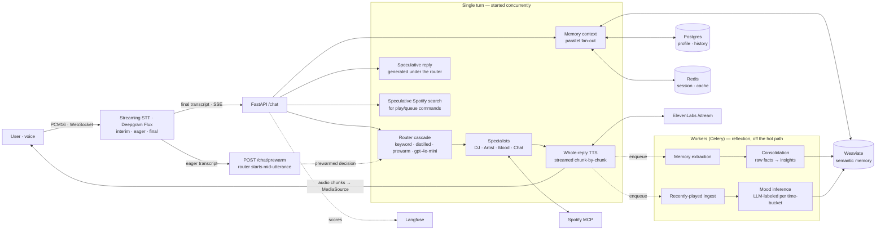

# Gia — a voice music companion

> A voice companion that knows your taste, sounds like a human, and notices your mood before you mention it — engineered to **start talking while it's still thinking**, streaming audio out as it's generated instead of making you wait for a finished paragraph.

Gia isn't a "play me a song" bot. She's a stateful companion: she remembers what you've told her, synthesises it into a picture of *who you are*, picks one track with a reason instead of dumping ten, and gently notices when your listening drifts from your usual pattern.

> Demo video: _[link]_

**At a glance:** voice in → first audio in **~4–6s** for chat (down from ~10s), a full reflective memory pipeline, graceful degradation on every external call, 454 tests, and per-turn observability with self-eval scores. Streaming STT (Deepgram Flux) removes the serial transcription wait, and the router now starts *mid-utterance* on the model's eager end-of-turn signal instead of after the user stops. The latency work below is a real, measured engineering story, including a feature I built, measured, and then **deleted** because the data said to.

---

## Contents

- [What it feels like](#what-it-feels-like)
- [Architecture](#architecture)
- [The thing I obsessed over: time-to-first-audio](#the-thing-i-obsessed-over-time-to-first-audio)
  - [The feature I built, measured, and deleted](#the-feature-i-built-measured-and-deleted)
- [Benchmarks](#benchmarks)
- [The memory system](#the-memory-system-why-she-feels-like-she-knows-you)
- [Production posture](#production-posture)
- [Design decisions & tradeoffs](#design-decisions--tradeoffs)
- [What I deliberately did not build](#what-i-deliberately-did-not-build-and-why)
- [Known limitations](#known-limitations)
- [Run it](#run-it)
- [Roadmap](#roadmap)

---

## What it feels like

- You speak; within a couple of seconds she's talking and the audio **streams as it's synthesised**, so she's mid-sentence before the full reply even exists.
- *"his music is fire"* → she **reacts to you**, she doesn't silently queue something. *"play that"* → she plays it.
- She recalls earlier turns ("did you ever finish that script?"), and over time forms **insights** not "likes Tems," but *"prefers emotionally expressive Afrobeats, leans to it when winding down."*

<table>
  <tr>
    <td></td>
    <td></td>
  </tr>
</table>

---

## Architecture



| Layer | Technology |
|---|---|
| **API** | FastAPI · SSE streaming · WebSocket |
| **AI / agents** | OpenAI · Anthropic · Ollama · litellm (one provider abstraction) · Langfuse tracing + self-eval scores |
| **Voice in** | Deepgram Flux streaming STT (WebSocket, end-of-turn detection) · OpenAI `whisper-1` batch fallback · provider-agnostic behind `STT_PROVIDER` |
| **Voice out** | ElevenLabs v3/flash streaming TTS · Kokoro (local dev) · progressive `MediaSource` playback |
| **Router** | Keyword fast-path · distilled MiniLM + scikit-learn classifier (`ml/router/`, ~10ms CPU) · eager prewarm reuse · `gpt-4o-mini` LLM tail |
| **Storage** | Weaviate (hybrid BM25 + dense vector memory) · Postgres / SQLAlchemy async · Redis (session · cache · throttles) |
| **Workers** | Celery · Celery Beat (memory extraction · consolidation · mood inference · session flush) |
| **Frontend** | Next.js · AudioWorklet mic capture · MediaSource progressive audio |
| **Integrations** | Spotify Web API via MCP server |

---

## The thing I obsessed over: time-to-first-audio

The metric isn't total response time — it's **TTFA**, when the user first hears Gia. I drove it from **~10s p99 to ~4–5s** (chat) by attacking the serial dead time on the critical path, profiling each stage in Langfuse, and removing the biggest blocks one at a time.

**1. Stream the TTS instead of waiting for the whole file.** This was the single biggest win. The pipeline had a complete sentence-streaming machine that the chat path *threw away* — it streamed the text, then synthesised the entire reply in one blocking call before sending a single audio byte. That was **~3.3s of dead silence** per turn. The fix sends the full reply text up-front to ElevenLabs' `/stream` endpoint (so `eleven_v3` keeps the ~250-char context it needs for natural prosody and audio-tag rendering) but **forwards the MP3 bytes as they render** — and the Next.js frontend plays them progressively through a `MediaSource` buffer. First audio now lands well before the file is finished.

**2. Take the router off the critical path.** A music product still needs the `gpt-4o-mini` router (~2s) to resolve intent, but most turns are chit-chat. So the conversational reply is **generated speculatively, concurrently with the router**, and emitted *only if* the router confirms a conversational intent. Correctness is identical — nothing is spoken before the router lands — but the router latency now overlaps the reply generation instead of preceding it.

**3. Speculative Spotify search for music commands.** When a play/queue command is detected, the Spotify search fires **in parallel with the router** (read-only — no playback). Its result is reused when the router's resolved query is "in" the user's words (token-overlap check); reference commands like *"just play it now"* (resolved from history) safely fall back to a fresh search. Playback side-effects always wait for the router, so nothing ever plays the wrong thing.

**4. Replies are spoken, so they're short.** A prompt that's tuned for *reading* writes paragraphs; spoken, that's slow to generate **and** slow to synthesise. Enforcing 1–2 sentences cut both — observed reply lengths dropped from ~200–530 chars to ~120–200.

**5. Small router, big thinker.** `gpt-4o-mini` classifies intent/tone/plan in one structured JSON call; the expensive persona model only runs when the turn actually needs it. Connection pools (a keep-alive httpx client for ElevenLabs) and a startup prewarm keep per-turn overhead off the hot path.

**6. Streaming STT, and a router that starts before you finish.** The front of the pipe was the last serial block: record → upload → transcribe meant **~1.5–2.8s of dead air** before `/chat` could even begin. The fix is a transport change — the browser captures the mic through an **AudioWorklet** and streams 24 kHz PCM frames over a WebSocket to a provider-agnostic streaming-STT layer (behind the same `STT_PROVIDER` switch as everything else). I chose **Deepgram Flux** (`/v2/listen`), the conversational model that does end-of-turn detection itself — so the client-side silence timer goes away, and the turn fires the instant Flux emits a confirmed `EndOfTurn`.

The same model unlocks **early-intent**: Flux emits an `EagerEndOfTurn` a beat *before* the user actually stops, with a transcript it guarantees will match the final. So the client fires `/chat/prewarm` on that eager text, the `gpt-4o-mini` router starts immediately, and when `/chat` arrives with the final transcript it **reuses the in-flight decision** instead of classifying cold — moving the router's ~2s off the critical path for the music/specialist turns where it was still serial. It's gated exactly like the speculative reply: classification is read-only, the prewarm key is the *exact* normalised transcript, and all search/playback still waits for the final, so a corrected utterance never acts on the wrong words. The prewarm result is cached in Redis, so the head start survives even when prewarm and `/chat` land on different workers. Both the streaming pipe and the prewarm reuse are validated end-to-end against the live Deepgram API; a full browser TTFA re-measure is the next step.

**7. A four-tier router cascade — and a distilled local classifier for the rest.** Profiling the traces showed the router was *still* the floor: even prewarmed, `gpt-4o-mini` is ~1.1–1.7s, and the eager lead time often isn't long enough to fully hide it. So the router became a cascade, fastest tier first:

```
keyword (sub-ms)           → explicit greetings / play commands
distilled classifier (~40–60ms, CPU)  → the confident chat/mood/memory majority   ← new
eager prewarm reuse        → music/specialist turns the eager signal got ahead of
cold gpt-4o-mini (~1.1–1.7s) → the genuinely ambiguous tail + anything needing a query
```

The new tier is a **distilled classifier**: every `router-classify` decision Langfuse has logged is a `(message → RouterDecision)` label, so the production `gpt-4o-mini` router is the **teacher** and a tiny local model is the **student**. The student is a *frozen* `all-MiniLM-L6-v2` sentence encoder + small `scikit-learn` linear heads — **not** an end-to-end fine-tune, which would be slow on CPU and overfit thin data. It predicts only the **categorical** fields (`intent`, `tone`, `engagement`, the `needs_*` flags) in **~7–10ms pure inference on CPU** (~40–60ms end-to-end including cascade overhead, measured from Langfuse); it never produces the free-form `search_query`, so it's gated to the intents that don't need one (`GENERAL_CHAT` / `MOOD_CHECK` / `MEMORY_QUERY`) and only when its top-class confidence clears a threshold. Everything else — music, artist, news, mixed, or low-confidence — falls through to the LLM, so **net accuracy stays the teacher's; only latency changes**. On the confident chat majority that's **~40–60ms instead of ~1.1–1.7s**.

The honest part is the data: the real corpus was 410 examples, 59% `GENERAL_CHAT`, with `MOOD_CHECK`/`MIXED`/`ARTIST_INFO` in single digits — unlearnable as-is. I balanced it by generating varied phrasings per intent and **labelling each with the production router** (teacher labels, not my guesses), to ~1,440 examples. Held-out intent accuracy is **0.78** — fine *because* it's confidence-gated. It's trained partly on synthetic data, so it's OFF by default and would be retrained as real traffic accumulates; the whole pipeline (extract → augment → train → serve) lives in [`ml/router/`](ml/router/). The point isn't the model — it's the cascade design, the confidence gating, and being straight about the data.

### The feature I built, measured, and deleted

Earlier the headline trick was an **acknowledgment** — a sub-ms keyword pass that spoke a neutral filler ("On it.") before the router returned. It demoed well in theory. In practice the data killed it:

- On fast **chat** turns it filled a gap of only ~0.3s, and on short text it sounded **robotic** — ElevenLabs v3 needs context to sound human, and a two-word filler gives it none.
- I tried scoping it to **music** turns only (where there's a real ~3–4s wait, and the filler's flash model matched the DJ reply's voice so they'd blend). It was better — but still added a synthetic "Gia talks at you" beat the user didn't want.

So I kept the mechanisms that reduce *real* latency (speculative reply + search) and **removed the one that only masked *perceived* latency.** Knowing the difference — and being willing to delete my own clever feature when it didn't earn its place — is the decision I'd most want a reviewer to see.

---

## Benchmarks

All numbers are end-to-end, measured from Langfuse traces and container-level micro-benchmarks (single dev box, RTX 4060, `gpt-4o`/`gpt-4o-mini`, ElevenLabs v3/flash).

**Time-to-first-audio**

| Turn type | Before | After |
|---|---:|---:|
| Chat / conversational | ~10s p99 | **~4–6s** |
| Music command | ~10s p99 | **~5–7s** |

**Per-stage (where the time goes now)**

| Stage | Latency | Notes |
|---|---:|---|
| STT — batch (OpenAI `whisper-1`) | ~1.5–2.8s | the old serial cost, before `/chat`; now the **fallback** path |
| STT — streaming (Deepgram Flux) | first interim <~0.3s, no serial wait | model does end-of-turn; the turn fires on `EndOfTurn`, the **new default** |
| Router — LLM (`gpt-4o-mini`, JSON) | ~1.1–1.7s | occasional spike to ~3.5s+; **overlapped via eager prewarm**; the tail tier |
| Router — distilled (MiniLM + linear heads, CPU) | **~40–60ms** end-to-end (pure inference ~7–10ms) | the confident chat/mood/memory majority; 0.78 held-out intent acc, confidence-gated |
| Conversational reply (`gpt-4o` stream) | TTFT ~0.6–1.2s | **overlapped under the router** via speculation |
| DJ specialist | ~2.8–4.5s | Spotify search ~2s + recommendation LLM ~1–2s; search removed from the path when speculation hits |
| TTS | was ~3.3s blocking → **streamed first byte <1s** | the headline win |

**STT micro-benchmark — why I *didn't* switch to local or `large-v3-turbo`**

I A/B'd the OpenAI Whisper API against local `faster-whisper` on the GPU, then benchmarked the model in isolation to decide whether `large-v3-turbo` was worth baking:

| Measurement (RTX 4060, `large-v3`, `int8_float16`) | Result |
|---|---:|
| Warm inference, 7s clip | ~1.1–1.8s |
| Warm inference, 15s clip | ~1.8–2.0s (barely scales) |
| webm/opus decode overhead | ~0.03s (negligible) |
| Idle-downclock penalty | ~0.35s |
| End-to-end `/voice/transcribe` in practice | ~2.0–3.8s |

The model floor (~1.1–2s) is real, but ~1–2s of production STT is **non-model overhead** that `turbo` can't touch (turbo only shrinks the decoder). So `turbo`'s realistic gain is ~0.5–1s — landing roughly *on par* with the OpenAI API's ~2s, for a 1.6 GB model bake. **Conclusion at the time: stay on `whisper-1`.** The interesting part isn't the answer, it's that the decision was *measured* instead of assumed.

> **Update:** that benchmark is what motivated the move to **streaming STT** (item 6). The real problem wasn't *which* batch model — every batch path pays ~1–2s of serial transcription before `/chat` starts. Streaming dissolves that wait entirely (and its interim results are what enable early-intent), so Deepgram Flux is now the default and the `whisper-1` path above is the graceful fallback.

---

## The memory system (why she feels like she knows you)

Memory is a real pipeline, not a chat-history window:

- **Extraction** — a background worker distils durable `preference` and `life_fact` memories from conversations (throttled, batched embeddings — one API call per pass).
- **Consolidation (the reflection loop)** — periodically, an LLM reads the *whole* set of raw facts and synthesises 2–4 higher-order **insights** ("uses music to focus; reaches for lyric-light tracks while working"). Insights are derived, so each run fully supersedes the last. They're injected *above* raw facts as the big-picture summary.
- **Retrieval** — hybrid search (BM25 for exact artist/track tokens + dense vectors for semantic intent), reranked, cached in Redis, assembled in parallel into one `UserContext`.
- **Mood, reflected from behavior** — recently-played tracks are ingested into history; a worker LLM-labels each `(weekday × time-of-day)` bucket into a closed mood vocabulary; when current listening drifts from the bucket's pattern, a proactive note is drafted for the next turn.

Everything degrades quietly — a flaky Weaviate or Spotify yields an empty slice, never a failed turn.

---

## Production posture

- **454 tests**, fully mocked external deps — runs offline, in CI, on a laptop.
- **Observability** — every turn is a Langfuse trace with nested agent spans and LLM generations, plus **self-evaluation scores** (`context_used`, `retrieval_used`, `router_confidence`, `turn_latency_ms`) so quality and cost are *measured*, not guessed.
- **Graceful degradation everywhere** — each external call has a fallback; a degraded service downgrades the turn, never breaks it.
- **Provider-agnostic** — OpenAI, Anthropic, and Ollama all work through one factory; no vendor lock-in.
- **Dependency-injected, typed** — Pydantic schemas at every boundary, protocol-based clients, externalised prompt templates.

<table>
  <tr>
    <td></td>
    <td></td>
  </tr>
</table>

---

## Design decisions & tradeoffs

**LLM provider abstraction via litellm directly.** OpenAI, Anthropic, and Ollama all route through a single `LLM` wrapper in `providers/llm.py` that calls `litellm.completion()` — one place to change the model, one place to add a provider, no vendor lock-in. The hot path orchestration is plain `asyncio`: the voice turn is async, streaming, and intent-driven, so the right tool is Python, not a framework.

**Spotify deprecated audio features mid-build — so I deleted them.** The DJ originally key-matched a crossfade queue using Camelot wheel + energy/valence. Spotify killed `/audio-features` for new apps, so those values became constants and the "harmonic sequencing" was a no-op. Rather than leave dead code computing on placeholders, I **removed the entire machinery** (crossfade module, audio-feature fetch, the feature fields on the track schema) and rebuilt queueing on signals that still exist: the user's stated track order, or search relevance. *Noticing the platform changed under me and re-architecting is the decision I'm most proud of here.*

**Mood, rebuilt the same way.** With audio features gone, mood couldn't be `(energy, valence)` quadrants. It's now an LLM labeling the *artists and track names* you actually play into a **closed vocabulary** — which keeps "current mood vs. your pattern" a clean string comparison instead of fuzzy numeric deviation.

**`played_at` is approximated.** Spotify's MCP recently-played carries no per-track timestamps, so ingestion stamps the poll time. With frequent use it's accurate to the time-bucket; I documented the approximation rather than pretend it's exact.

**Self-eval is deterministic, not an LLM judge.** I log cheap, free signals per turn instead of spending an extra LLM call (and latency) grading every reply. An LLM-as-judge is the obvious next step *once there's real traffic to sample.*

**Reflection runs in the background, never on the hot path.** Consolidation and mood inference are Celery jobs triggered after a turn streams — the user never waits on "analyze six months of history."

---

## What I deliberately did *not* build (and why)

A portfolio is as much about scope judgment as features. Things I chose to leave out, with the reason:

- **Episodic memory, user embeddings, predictive recommendations** — these need *real usage data* to be anything but theater. With one seeded demo user I'd be tuning against synthetic data. The right time is after launch, when there's behavior to learn from.
- **Multi-modal memory & a social graph** — different products. Out of scope for a focused voice companion.
- **Full real-time barge-in (WebRTC)** — streaming STT (item 6) already moved capture to a WebSocket and Deepgram Flux exposes the `StartOfTurn` signal barge-in needs, so the groundwork is in; wiring interrupt-while-Gia-speaks is a focused follow-up, not the transport rewrite it was before.
- **A general speculative-execution framework** — I built *targeted* speculation where it pays (the conversational reply and the Spotify search, both gated so they never affect correctness). A generic "speculate every tool call" engine would add double-spend and reconciliation complexity the rest of the pipeline doesn't need.

The discipline of *not* building these is the point: I'd rather ship a focused system I can stand behind than a sprawling one that's 60% done.

---

## Known limitations

Stated plainly, because honest scope reads better than a flawless pitch:

- **TTFA is still above the conversational threshold.** The target for voice AI that feels natural is **700–1000ms** TTFA. The current ~4–6s (chat) / ~5–7s (music) is a real improvement from ~10s, but it isn't there yet. The bottleneck isn't transport — it's inference. Even with everything running in parallel and speculation hitting, the irreducible floor is LLM TTFT (~600–1200ms for gpt-4o) plus TTS first-byte (~800–1000ms for ElevenLabs streamed), which puts the hard minimum around 1.5–2s on cloud APIs regardless of how much pipeline parallelism is added. Switching to WebRTC (LiveKit/Pipecat) would save the HTTP transport overhead (~100–200ms) but wouldn't touch those inference costs — it's a meaningful but small gain. The real path to sub-1s is a faster LLM provider (Groq or Cerebras get TTFT to ~150–200ms on smaller models) paired with a lower-latency TTS (Cartesia or local Kokoro get first-byte under 200ms) — but that's a model quality tradeoff, not just an infrastructure swap, and I haven't made it.
- **Browser playback is verified by types/tests, not a full cross-browser pass.** The progressive `MediaSource` playback is unit-tested and type-checked end-to-end; a manual smoke test across browsers is still pending. Safari's `MediaSource` support for `audio/mpeg` is limited — Chrome/Edge/Firefox are the supported targets.
- **Speculation only helps "guessable" music commands.** *"play some Drake"* lets the search run early; *"yeah, that one"* / *"land on something"* resolve from conversation history, so the query can't be pre-guessed and those turns pay the full serial `router → search → phrase`.
- **The router was the latency wild card — now largely tamed.** `gpt-4o-mini` is ~1.1–1.7s (occasional spike to ~3.5s+). Three tiers now keep it off the hot path: the keyword fast-path, the distilled local classifier (~10ms for the confident chat majority), and eager prewarm for the rest — the cold LLM only runs on the genuinely ambiguous tail or turns needing a resolved `search_query`. The remaining caveat is the classifier's data: held-out accuracy is 0.78 and it's trained partly on synthetic phrasings, so it's confidence-gated (misses fall back to the LLM) and OFF by default until there's enough real traffic to retrain on.
- **Streaming STT is validated against the live API, not yet browser-measured.** The Deepgram Flux pipe and the prewarm reuse are proven end-to-end server-side; the full in-browser TTFA with the AudioWorklet capture is the pending measurement. If streaming is unavailable, the client falls back to the batch `whisper-1` path automatically.
- **One seeded demo user.** The memory and mood systems are structurally complete but validated against synthetic history, not real usage at scale — by design (see above).
- **Dev ergonomics traded for stability.** `uvicorn --reload` is disabled in Docker because the file watcher is unstable on Windows bind mounts; code changes need a container recreate locally.

---

## Responsible design

Gia helps and lets you go — she doesn't fish for engagement. She never auto-plays, queues, or creates playlists without a confirmed "yes" in the same turn. She only states facts that are in her retrieved context (grounding refs included), so she attributes rather than invents. Asked if she's an AI, she says so.

---

## Run it

```bash
cp .env.example .env
# Minimum: an LLM provider key — OPENAI_API_KEY (default) or ANTHROPIC_API_KEY,
#          or LLM_PROVIDER=ollama for a fully local brain.
# Full voice path also wants: ELEVENLABS_API_KEY + ELEVENLABS_VOICE_ID (streaming TTS)
#          and, for streaming STT, DEEPGRAM_API_KEY with STT_PROVIDER=deepgram (the default).
#          Set STT_PROVIDER=openai (+ OPENAI_API_KEY) for the batch whisper-1 fallback.
#          Without any STT, text still streams; audio is silent.
docker compose up --build           # api :8000 · web :3000 · postgres · redis · weaviate
# First run — seed the demo user + synthetic history
python scripts/seed_user.py
curl localhost:8000/health
```

```bash
# Tests (454, fully mocked — no network/keys needed)
pytest -q
```

> STT defaults to **streaming Deepgram Flux** (`STT_PROVIDER=deepgram`). The api image no longer bakes local `faster-whisper` (`INSTALL_LOCAL_STT=false`) — it isn't needed for streaming, and it pulled ~1.3GB of CUDA wheels + a ~3GB model. If the streaming socket ever fails, the one-shot `/voice/transcribe` fallback auto-routes to the **OpenAI Whisper API**. Set `INSTALL_LOCAL_STT=true` only to run whisper locally on the GPU.

---

## Roadmap

- Retrain the distilled router on **real** traffic (it's currently bootstrapped on synthetic + teacher labels) and lower the confidence gate as accuracy climbs
- Memory consolidation → user-state precompute (mood, top artists, weekly trend) as a cached snapshot
- LLM-as-judge self-evaluation + a small Ragas-style RAG eval, sampled from Langfuse traces (deferred until there's real query traffic to grade)
- **Barge-in (interrupt-and-correct UX)** — let the user cut in *while Gia is speaking* to correct or redirect her. Two paths: a lighter version on the current stack (keep the mic open during TTS, use Flux's `StartOfTurn` to stop playback and switch to listening, lean on browser echo-cancellation), or the robust version via a WebRTC pipeline (LiveKit / Pipecat) which also brings production-grade turn-taking and mobile/telephony. (Mid-sentence cut-offs are already tuned out via the Flux `eot_threshold`.)
- User-editable memory ("Gia, forget that")
- Shared listening — two users, one queue
