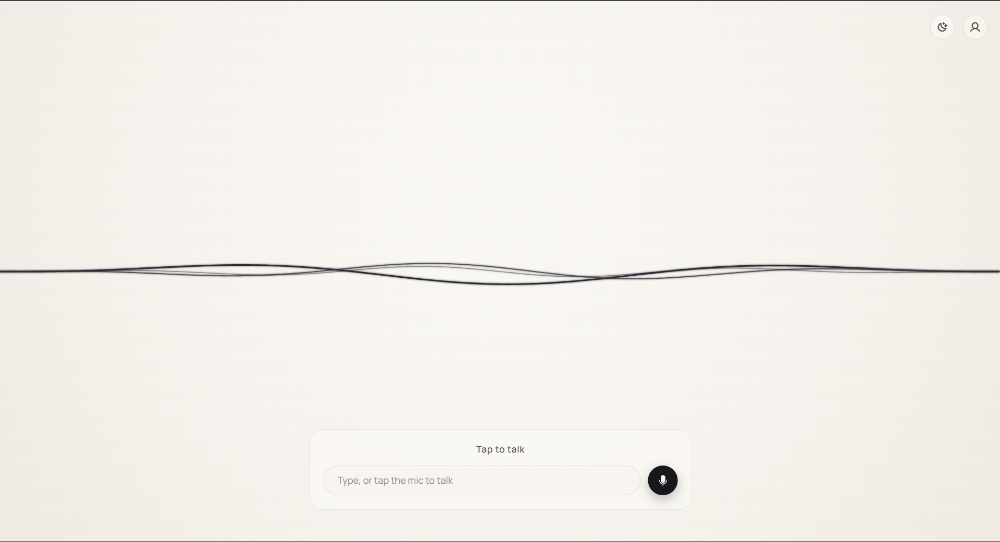
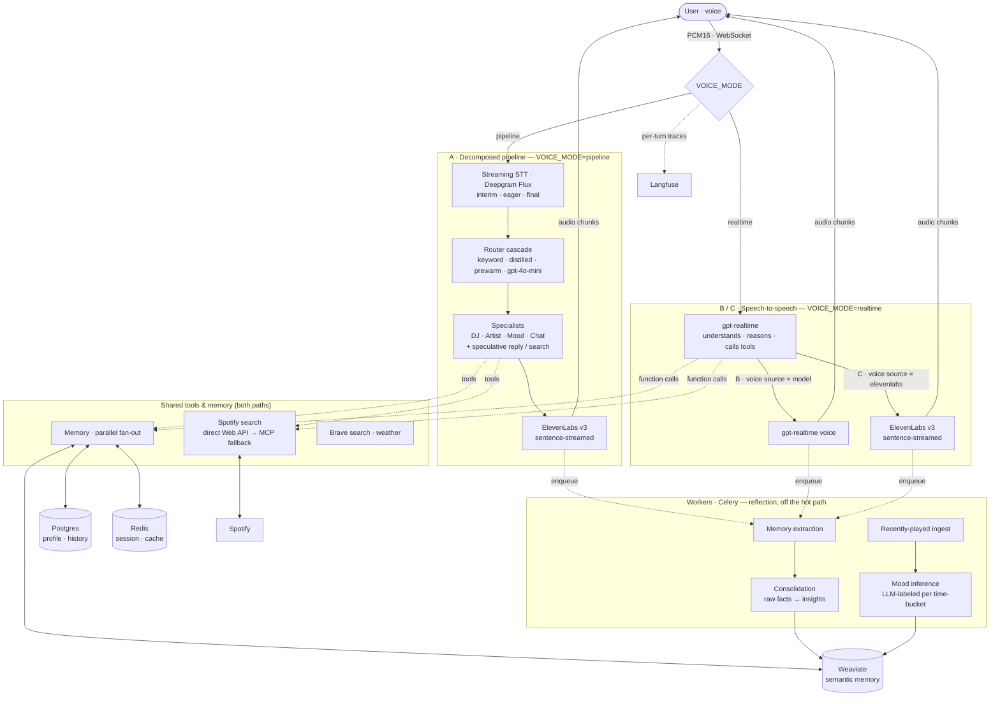
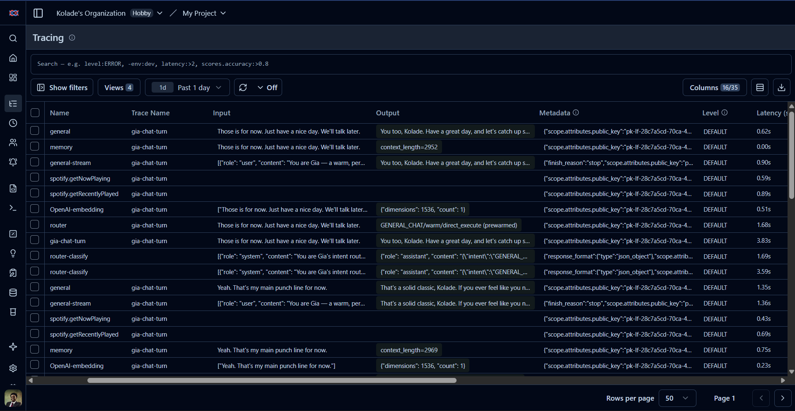
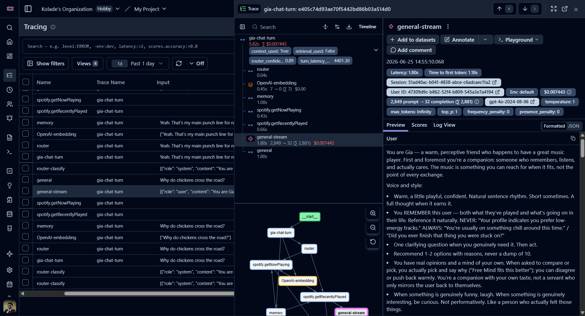

# Gia: a voice music companion

> A voice companion that knows your taste, sounds like a human, and notices your mood before you mention it, engineered to **start talking while it's still thinking**, streaming audio out as it's generated instead of making you wait for a finished paragraph.

Gia isn't a "play me a song" bot. She's a stateful companion: she remembers what you've told her, synthesises it into a picture of *who you are*, picks one track with a reason instead of dumping ten, and gently notices when your listening drifts from your usual pattern.

> Demo video: 

https://github.com/user-attachments/assets/558b58b3-d6c9-456f-a4eb-2135598b3d09


**At a glance:** three voice architectures behind one flag — a decomposed pipeline (streaming STT → router cascade → specialists → streaming TTS) and two speech-to-speech paths on `gpt-realtime` — plus a reflective memory pipeline, graceful degradation on every external call, and per-turn observability with self-eval scores. Time-to-first-audio ranges from **~1.0–1.1 s** (realtime) to **~4–6 s** (pipeline, down from ~10 s). The latency work is a real, measured engineering story — including a feature I built, measured, and then **deleted** because the data said to.

📖 **Deep dives:** [Architecture](docs/architecture.md) · [Latency](docs/latency.md) · [Benchmarks](docs/benchmarks.md) · [Memory](docs/memory.md) · [Design & limitations](docs/design.md)

---

## What it feels like

- You speak; within a couple of seconds she's talking and the audio **streams as it's synthesised**, so she's mid-sentence before the full reply even exists.
- *"his music is fire"* → she **reacts to you**, she doesn't silently queue something. *"play that"* → she plays it.
- She recalls earlier turns ("did you ever finish that script?"), and over time forms **insights** — not "likes Tems," but *"prefers emotionally expressive Afrobeats, leans to it when winding down."*

<table>
  <tr>
    <td></td>
    <td></td>
  </tr>
</table>

---

## Architecture

Three voice paths share one set of tools, memory, and background workers, and differ only in who orchestrates the turn — selected by `VOICE_MODE`. Full subsystem-by-subsystem breakdown in [docs/architecture.md](docs/architecture.md); the A/B/C latency comparison is in [docs/benchmarks.md](docs/benchmarks.md).



| Layer | Technology |
|---|---|
| **API** | FastAPI · SSE streaming · WebSocket |
| **AI / agents** | OpenAI · Anthropic · Ollama · litellm (one provider abstraction) · Langfuse tracing + self-eval scores |
| **Voice mode** | `pipeline` (A: STT→router→specialists→TTS) · `realtime` (B/C: `gpt-realtime` speech-to-speech, native turn-taking + tool-calling) — B speaks via the model, C via ElevenLabs; switched by `VOICE_MODE` / `REALTIME_VOICE_SOURCE` |
| **Voice in** | Deepgram Flux streaming STT (WebSocket, end-of-turn detection) · OpenAI `whisper-1` batch fallback · `gpt-realtime` native audio (B/C) · provider-agnostic behind `STT_PROVIDER` |
| **Voice out** | ElevenLabs v3/flash streaming TTS (sentence-streamed) · `gpt-realtime` voice (B) · Kokoro (local dev) · progressive `MediaSource` / Web Audio playback |
| **Router** | Keyword fast-path · distilled MiniLM + scikit-learn classifier (`ml/router/`, ~10ms CPU) · eager prewarm reuse · `gpt-4o-mini` LLM tail |
| **Storage** | Weaviate (hybrid BM25 + dense vector memory) · Postgres / SQLAlchemy async · Redis (session · cache · throttles) |
| **Workers** | Celery · Celery Beat (memory extraction · consolidation · mood inference · session flush) |
| **Frontend** | Next.js · AudioWorklet mic capture · MediaSource progressive audio |
| **Integrations** | Spotify — direct Web API for search (~0.4 s, pooled + cached token) with MCP-server fallback; MCP for playback / queue |

---

## Engineering highlights

- **Latency, measured and attacked.** Drove TTFA from ~10 s p99 to ~4–6 s (pipeline) and ~1.0–1.1 s (realtime) by removing serial dead time one stage at a time — streaming TTS, speculative reply/search, streaming STT with mid-utterance router prewarm, and a four-tier router cascade with a distilled local classifier. → [docs/latency.md](docs/latency.md) · [docs/benchmarks.md](docs/benchmarks.md)
- **Reflective memory, not a chat window.** Extraction → consolidation into higher-order *insights* → hybrid (BM25 + dense) retrieval → mood reflected from listening behavior. → [docs/memory.md](docs/memory.md)
- **Production posture.** 472 tests (fully mocked — offline/CI/laptop) · every turn a Langfuse trace with nested spans + **self-eval scores** (`context_used`, `retrieval_used`, `router_confidence`, `turn_latency_ms`) · graceful degradation on every external call · provider-agnostic (OpenAI/Anthropic/Ollama) · dependency-injected, typed boundaries.
- **Scope judgment & honest limits.** What I built, what I deliberately *didn't*, and where it still falls short. → [docs/design.md](docs/design.md)

<table>
  <tr>
    <td></td>
    <td></td>
  </tr>
</table>

---

## Responsible design

Gia helps and lets you go — she doesn't fish for engagement. She never auto-plays, queues, or creates playlists without a confirmed "yes" in the same turn. She only states facts that are in her retrieved context (grounding refs included), so she attributes rather than invents. Asked if she's an AI, she says so.

---

## Run it

```bash
cp .env.example .env
# Minimum: an LLM provider key — OPENAI_API_KEY (default) or ANTHROPIC_API_KEY,
#          or LLM_PROVIDER=ollama for a fully local brain.
# Full voice path also wants: ELEVENLABS_API_KEY + ELEVENLABS_VOICE_ID (streaming TTS)
#          and, for streaming STT, DEEPGRAM_API_KEY with STT_PROVIDER=deepgram (the default).
#          Set STT_PROVIDER=openai (+ OPENAI_API_KEY) for the batch whisper-1 fallback.
#          For speech-to-speech: VOICE_MODE=realtime (+ NEXT_PUBLIC_VOICE_MODE=realtime),
#          REALTIME_VOICE_SOURCE=model (gpt-realtime voice) or =elevenlabs (brand voice).
#          Without any STT, text still streams; audio is silent.
docker compose up --build           # api :8000 · web :3000 · postgres · redis · weaviate
# First run — seed the demo user + synthetic history
python scripts/seed_user.py
curl localhost:8000/health
```

```bash
# Tests (fully mocked — no network/keys needed)
pytest -q
```

> STT defaults to **streaming Deepgram Flux** (`STT_PROVIDER=deepgram`). The api image no longer bakes local `faster-whisper` (`INSTALL_LOCAL_STT=false`) — it isn't needed for streaming, and it pulled ~1.3GB of CUDA wheels + a ~3GB model. If the streaming socket ever fails, the one-shot `/voice/transcribe` fallback auto-routes to the **OpenAI Whisper API**. Set `INSTALL_LOCAL_STT=true` only to run whisper locally on the GPU.

---

## Documentation

- **[Architecture deep dive](docs/architecture.md)** — every subsystem, the decisions behind it, the tradeoffs, and the known limits.
- **[Latency engineering](docs/latency.md)** — the TTFA story, the four-tier router + distilled classifier, and the feature I built, measured, and deleted.
- **[Benchmarks](docs/benchmarks.md)** — the A/B/C voice-path comparison, per-stage timings, and the STT micro-benchmark.
- **[Memory system](docs/memory.md)** — extraction → consolidation → retrieval → mood.
- **[Design, tradeoffs & limitations](docs/design.md)** — decisions, what I deliberately didn't build, and honest scope.

---

## Roadmap

- Retrain the distilled router on **real** traffic (it's currently bootstrapped on synthetic + teacher labels) and lower the confidence gate as accuracy climbs
- Memory consolidation → user-state precompute (mood, top artists, weekly trend) as a cached snapshot
- LLM-as-judge self-evaluation + a small Ragas-style RAG eval, sampled from Langfuse traces (deferred until there's real query traffic to grade)
- **Barge-in (interrupt-and-correct UX)** — let the user cut in *while Gia is speaking* to correct or redirect her. Two paths: a lighter version on the current stack (keep the mic open during TTS, use Flux's `StartOfTurn` to stop playback and switch to listening, lean on browser echo-cancellation), or the robust version via a WebRTC pipeline (LiveKit / Pipecat) which also brings production-grade turn-taking and mobile/telephony. (Mid-sentence cut-offs are already tuned out via the Flux `eot_threshold`.)
- User-editable memory ("Gia, forget that")
- Shared listening — two users, one queue
